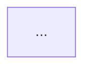

# 用途与边界

| Skill | 读者 | 职责 |
|-------|------|------|
| **mdocs-dev** | Agent + 人审 | 契约、举证、设计门控 — **不画给人读的图册** |
| **diagram**（本 skill） | 人（图）+ Agent（语法） | 专画 **Mermaid**，落盘并可从 README 索引 |
| **mdocs-cli** | Agent | 需要推远程时再用 `create` / `update`（本 skill **不**负责推送） |

# 落盘约定（方案 A）

```
.mdocs-docs/
├── README.md                 # 必须能索引到 diagrams/
└── diagrams/
    ├── README.md             # 图文档索引（推荐）
    └── <与主题相关的短名>.md # 一个主题一篇，文件名反映主图含义
```

## 命名

- 文件名用短横线英文或简明中文均可，**必须与主图主题相关**，例如：`auth-flow.md`、`domain-tree.md`、`publish-sequence.md`
- **禁止** 无意义名：`diagram1.md`、`tmp.md`、`new.md`
- 一文可含多张图，但主图主题应与文件名一致

## 单篇图文档结构

```markdown
# <主题标题>

> 一句话：这张（组）图说明什么。

## <主图标题>



## （可选）补充图

```mermaid
sequenceDiagram
  ...
```
```

## README 索引义务

新建或更新图文档后，**立刻**更新：

1. `.mdocs-docs/diagrams/README.md` — 列出图文件与一句话说明  
2. `.mdocs-docs/README.md` — 若尚无 diagrams 入口，增加指向 `diagrams/README.md` 的链接

示例（`diagrams/README.md`）：

```markdown
# Diagrams

| 文档 | 说明 |
|------|------|
| [auth-flow.md](./auth-flow.md) | 访客 Token 鉴权流程 |
| [publish-sequence.md](./publish-sequence.md) | 草稿发布与乐观锁时序 |
```

# 画图工作流

1. **识别图类型**（见下方路由表）
2. **先读**对应 `references/<type>.md`，再写语法（勿凭记忆）
3. 写入 `.mdocs-docs/diagrams/<主题>.md`
4. 更新 `diagrams/README.md` 与（如需）`.mdocs-docs/README.md` 索引
5. 在对话中可用 ` ```mermaid ` 预览；**以落盘文件为准**

# 图类型路由

| 用户意图 | 类型 | 参考文件 |
|----------|------|----------|
| 流程、决策树、工作流 | Flowchart | `references/flowchart.md` |
| 参与方消息交互 | Sequence | `references/sequence.md` |
| 类 / OOP 结构 | Class | `references/classDiagram.md` |
| 状态机、生命周期 | State | `references/stateDiagram.md` |
| 表结构、实体关系 | ER | `references/erDiagram.md` |
| 层级头脑风暴 | Mindmap | `references/mindmap.md` |
| 系统 / 服务映射 | Architecture | `references/architecture.md` |
| C4 上下文/容器 | C4 | `references/c4.md` |
| 日程 | Gantt | `references/gantt.md` |
| 时间线 | Timeline | `references/timeline.md` |
| 其它类型 | 见 `references/` 目录 | 同名 md |

不确定时先问用户要可视化什么，再选类型。

# 语法要点（摘要）

- 每种图有独立声明关键字（如 `flowchart TD`、`sequenceDiagram`）
- flowchart 中小写 `end` 作节点名会坏图，改用 `End` / 引号
- 含特殊字符的节点文案用引号
- 详细规则以对应 `references/` 为准

# 与 mdocs-dev 分工

- 需求分析 / 设计契约 / map / decisions → **mdocs-dev**
- 给人看的架构图、时序图、流程图 → **diagram**（本 skill）
- 设计契约里若需附图：在契约中 **链接** `diagrams/xxx.md`，不把大段 Mermaid 塞进契约正文（可放一小段摘要图）
