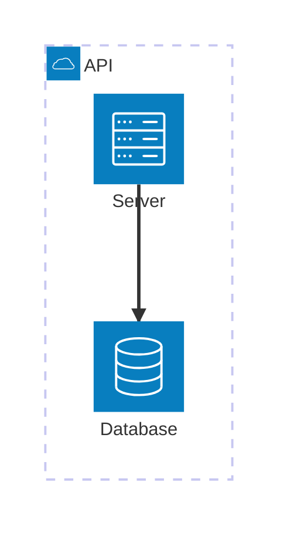

# Architecture Diagram Syntax

## Declaration
```
architecture-beta
```

## Groups
```
group groupId(iconName)[title]
group groupId(iconName)[title] in parentGroup
```

## Services
```
service serviceId(iconName)[title]
service serviceId(iconName)[title] in parentGroup
```

## Junctions
```
junction junctionId
junction junctionId in parentGroup
```

## Default Icons
- `cloud`, `database`, `disk`, `internet`, `server`

## Custom Icons
```
name:icon-name
```
Format after registering an icon pack.

## Edges
```
serviceId:T|B|L|R (<)?--(>)? T|B|L|R:serviceId
```
- Sides: `T` (top), `B` (bottom), `L` (left), `R` (right)
- Arrow directions: `<>` (both), `<` (left), `>` (right), `--` (none)

### Edge from/to Groups
```
serviceId{group}:side --> side:serviceId{group}
```

## Configuration
```
config:
  randomize: boolean
  nodeSeparation: number
  idealEdgeLengthMultiplier: number
  edgeElasticity: number
  numIter: number
```

## Example


## Comments
```
%% This is a comment
```
