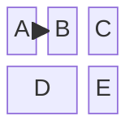

# Block Diagram Syntax

## Declaration
```
block
```

## Columns
```
columns N
```
Sets the number of columns in a row.

## Block Placement
- Blocks on same line separated by space: `a b c`
- Block spanning multiple columns: `blockId:N` spans N columns

## Labels
```
id["label text"]
```

## Composite Blocks
```
block:groupId
    %% child blocks
end
```
With width: `block:groupId:width ... end`

## Space Blocks
```
space
space:N
```

## Block Shapes
| Shape | Syntax |
|-------|--------|
| Square (default) | `id["label"]` |
| Round edges | `id("label")` |
| Stadium | `id(["label"])` |
| Subroutine | `id[["label"]]` |
| Cylinder | `id[("label")]` |
| Circle | `id(("label"))` |
| Double circle | `id((("label")))` |
| Asymmetric | `id>"label"]` |
| Rhombus | `id{"label"}` |
| Hexagon | `id{{"label"}}` |
| Parallelogram | `id[/"label"/]` |
| Trapezoid | `id[\"label"\]` |

## Block Arrows
```
id<["label"]>(direction)
```
Directions: `right`, `left`, `up`, `down`, `x`, `y`

## Edges
```
A --> B
A -- "text" --> B
```

## Styling
```
style id fill:#969,stroke:#333
classDef name fill:#696,stroke:#333
class id className
```

## Example


## Comments
```
%% This is a comment
```
