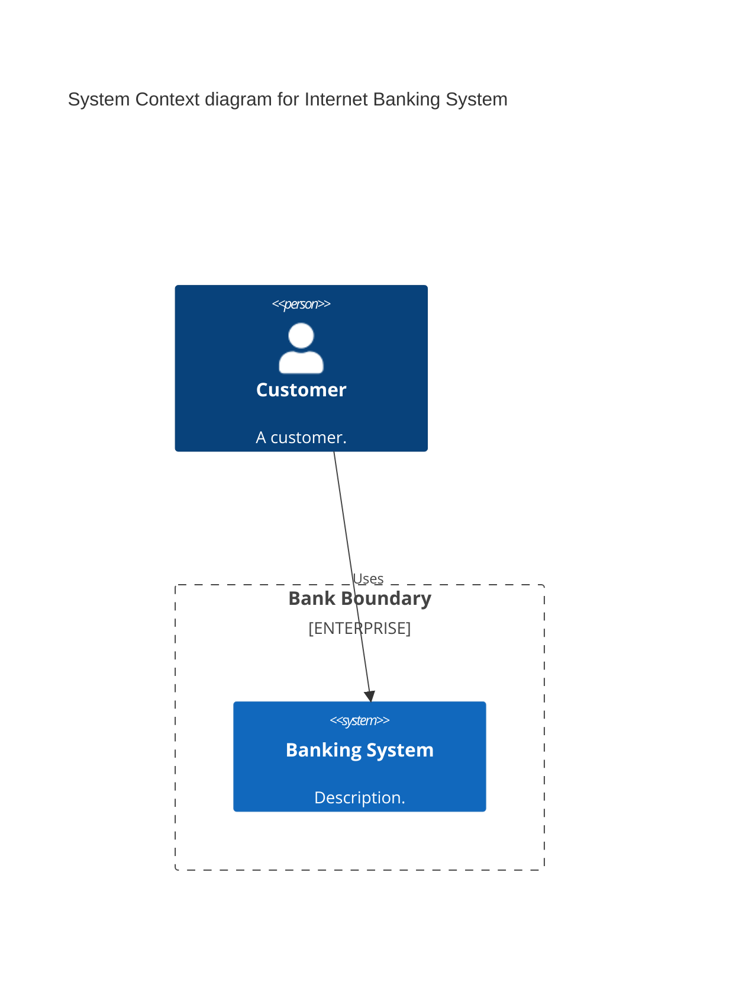

# C4 Diagram Syntax

## Diagram Types
- `C4Context` - System context view
- `C4Container` - Container view
- `C4Component` - Component view
- `C4Dynamic` - Dynamic/sequence view
- `C4Deployment` - Deployment view

Compatible with PlantUML syntax.

## Title
```
title Diagram Title
```

## Elements

### People
- `Person(alias, "Label", "Optional Description")`
- `Person_Ext(alias, "Label", "Optional Description")`

### Systems
- `System(alias, "Label", "Optional Description")`
- `System_Ext(alias, "Label", "Optional Description")`
- `SystemDb(alias, "Label", "Optional Description")`
- `SystemDb_Ext(alias, "Label", "Optional Description")`
- `SystemQueue(alias, "Label", "Optional Description")`
- `SystemQueue_Ext(alias, "Label", "Optional Description")`

### Containers (use in C4Container, C4Component)
- `Container(alias, "Label", "Technology", "Optional Description")`
- `Container_Ext(alias, "Label", "Technology", "Optional Description")`
- `ContainerDb(alias, "Label", "Technology", "Optional Description")`
- `ContainerDb_Ext(alias, "Label", "Technology", "Optional Description")`
- `ContainerQueue(alias, "Label", "Technology", "Optional Description")`
- `ContainerQueue_Ext(alias, "Label", "Technology", "Optional Description")`

### Components (use in C4Component)
- `Component(alias, "Label", "Technology", "Optional Description")`
- `Component_Ext(alias, "Label", "Technology", "Optional Description")`
- `ComponentDb(alias, "Label", "Technology", "Optional Description")`
- `ComponentDb_Ext(alias, "Label", "Technology", "Optional Description")`
- `ComponentQueue(alias, "Label", "Technology", "Optional Description")`
- `ComponentQueue_Ext(alias, "Label", "Technology", "Optional Description")`

### Deployment Nodes (use in C4Deployment)
- `Deployment_Node(alias, "Label", "Type", "Optional Description")`
- `Node(alias, "Label", "Type", "Optional Description")`
- `Node_L(alias, "Label", "Type", "Optional Description")`
- `Node_R(alias, "Label", "Type", "Optional Description")`

## Boundaries
- `Boundary(alias, "Label", "Optional Type")`
- `Enterprise_Boundary(alias, "Label")`
- `System_Boundary(alias, "Label")`
- `Container_Boundary(alias, "Label")`

### Nested Boundaries
```
System_Boundary(systemAlias, "System Name") {
    Container_Boundary(containerAlias, "Container Name") {
        Component(compAlias, "Component", "techn", "descr")
    }
}
```

## Relationships
- `Rel(from, to, "Label")` or `Rel(from, to, "Label", "Technology")`
- `BiRel(from, to, "Label", "Optional Technology")` - bidirectional
- Directional: `Rel_U/Up`, `Rel_D/Down`, `Rel_L/Left`, `Rel_R/Right`
- `Rel_Back(from, to, "Label")` - reverse direction arrow

### Dynamic Diagram Relationships
- `RelIndex(index, from, to, "Label")` - numbered sequence

## Styling
```
UpdateElementStyle(elementName, $fontColor="#FFFFFF", $bgColor="#059719", $borderColor="#000000")
UpdateRelStyle(fromAlias, toAlias, $textColor="red", $lineColor="red", $offsetX=5, $offsetY=5)
```

## Layout
```
UpdateLayoutConfig($c4ShapeInRow=3, $c4BoundaryInRow=1)
```

## Line Breaks
Use `<br/>` for line breaks in descriptions.

## Example


## Comments
```
%% This is a comment
```
