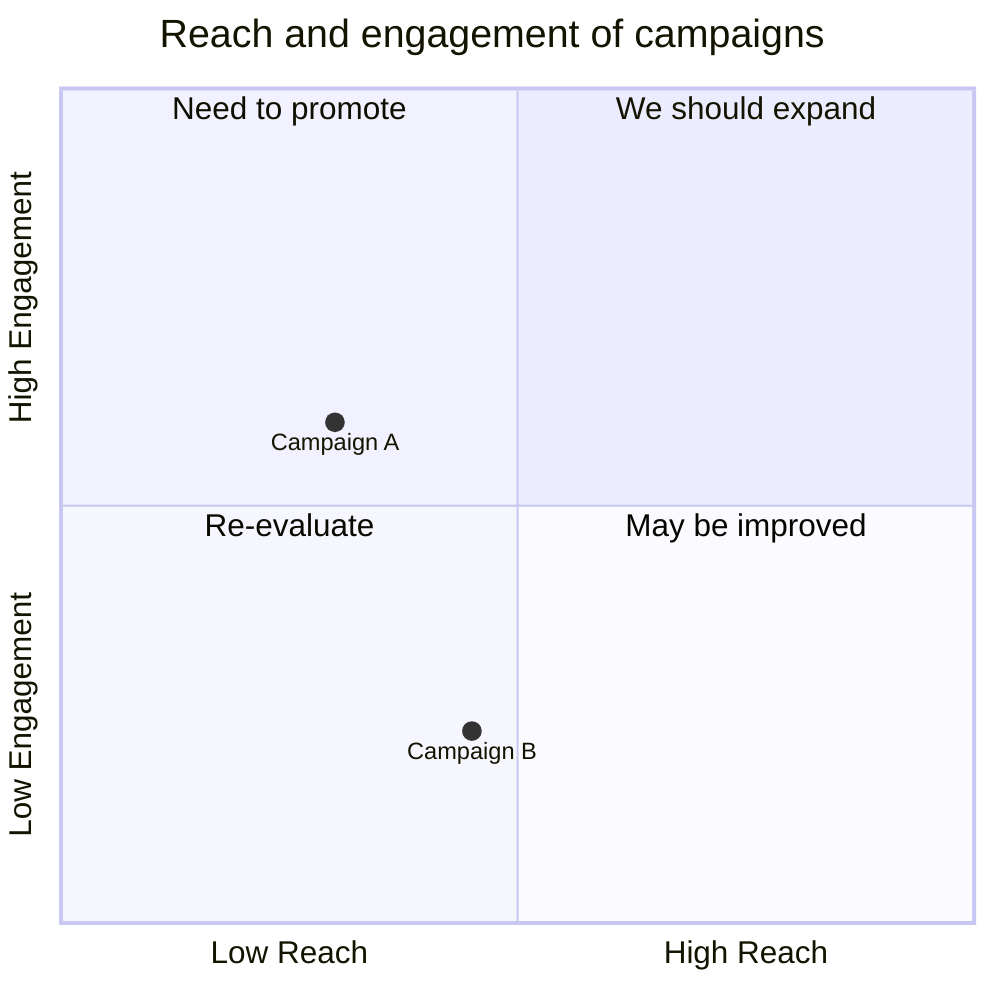

# Quadrant Chart Syntax

## Declaration
```
quadrantChart
```

## Title
```
title Chart Title
```

## Axes
```
x-axis Left Text --> Right Text
x-axis Text
y-axis Bottom Text --> Top Text
y-axis Text
```

## Quadrants
```
quadrant-1 Top Right Label
quadrant-2 Top Left Label
quadrant-3 Bottom Left Label
quadrant-4 Bottom Right Label
```

## Points
```
Point Name: [x, y]
```
- `x` and `y` are values from 0 to 1.

## Point Styling
```
Point Name: [x, y] radius: 12, color: #ff3300
```

## Class Styling
```
Point Name:::className: [x, y]
classDef className color: #109060, radius: 10
```

## Configuration
```
config:
    chartWidth: number
    chartHeight: number
    titlePadding: number
    titleFontSize: number
    quadrantPadding: number
    quadrantTextTopPadding: number
    quadrantTextRightPadding: number
    quadrantTextBottomPadding: number
    quadrantTextLeftPadding: number
    pointTextPadding: number
    pointLabelFontSize: number
    pointRadius: number
    xAxisPosition: top|bottom
    yAxisPosition: left|right
    xAxisLabelFontSize: number
    yAxisLabelFontSize: number
```

## Theme Variables
- `quadrant1Fill`, `quadrant2Fill`, `quadrant3Fill`, `quadrant4Fill`
- `quadrant1TextFill`, `quadrant2TextFill`, `quadrant3TextFill`, `quadrant4TextFill`
- `quadrantPointFill`, `quadrantPointTextFill`
- `quadrantXAxisTextFill`, `quadrantYAxisTextFill`
- `quadrantTitleFill`
- `quadrantInternalDividerStrokeFill`, `quadrantExternalBorderStrokeFill`

## Example


## Comments
```
%% This is a comment
```
