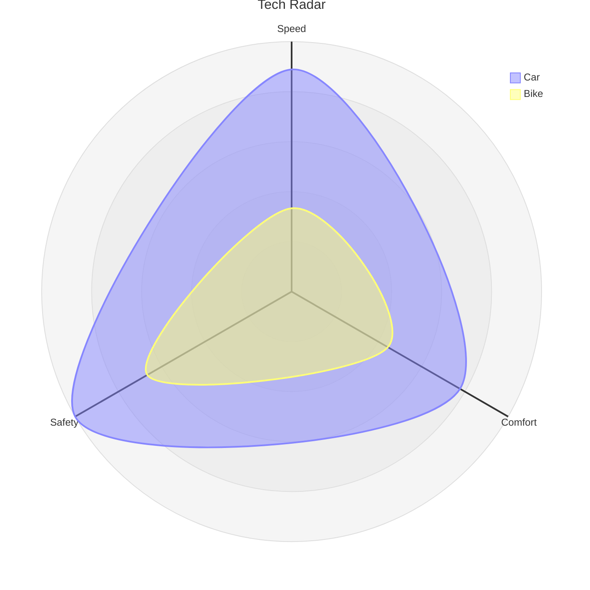

# Radar Chart Syntax

## Declaration
```
radar-beta
```

## Title
```
title Chart Title
```

## Axis
```
axis id1["Label1"]
axis id1["Label1"], id2["Label2"], id3["Label3"]
```
Multiple axes can be declared on one line separated by commas.

## Curve
Positional values (must match axis count/order):
```
curve id1["Label1"]{val1, val2, val3}
```

Key-value (order-independent):
```
curve id1{ axisId: value, axisId: value }
```

## Options
```
showLegend true|false
max N
min N
graticule circle|polygon
ticks N
```

## Configuration
```
config:
    width: number
    height: number
    marginTop: number
    marginBottom: number
    marginLeft: number
    marginRight: number
    axisScaleFactor: number
    axisLabelFactor: number
    curveTension: number
```

## Theme Variables
- `cScale${i}` - curve colors (cScale0, cScale1, cScale2, ...)
- `radar.axisColor`
- `radar.curveOpacity`
- `radar.axisLabelFontSize`
- `radar.axisLabelColor`

## Example


## Comments
```
%% This is a comment
```
