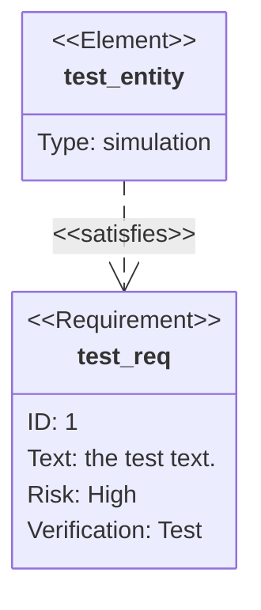

# Requirement Diagram Syntax

## Declaration
```
requirementDiagram
```

## Requirement Types
- `requirement`
- `functionalRequirement`
- `interfaceRequirement`
- `performanceRequirement`
- `physicalRequirement`
- `designConstraint`

## Requirement Definition
```
type name {
    id: value
    text: value
    risk: Low|Medium|High
    verifymethod: Analysis|Inspection|Test|Demonstration
}
```

## Element Definition
```
element name {
    type: value
    docref: value
}
```

## Relationships
```
source - type -> dest
dest <- type - source
```

### Relationship Types
- `contains`
- `copies`
- `derives`
- `satisfies`
- `verifies`
- `refines`
- `traces`

## Direction
```
direction TB|BT|LR|RL
```

## Markdown Formatting
Use `**bold**` and `*italic*` within quotes for text formatting.

## Styling
```
style name fill:#ffa
classDef name fill:#f96
class name className
name:::className
```

## Example


## Comments
```
%% This is a comment
```
