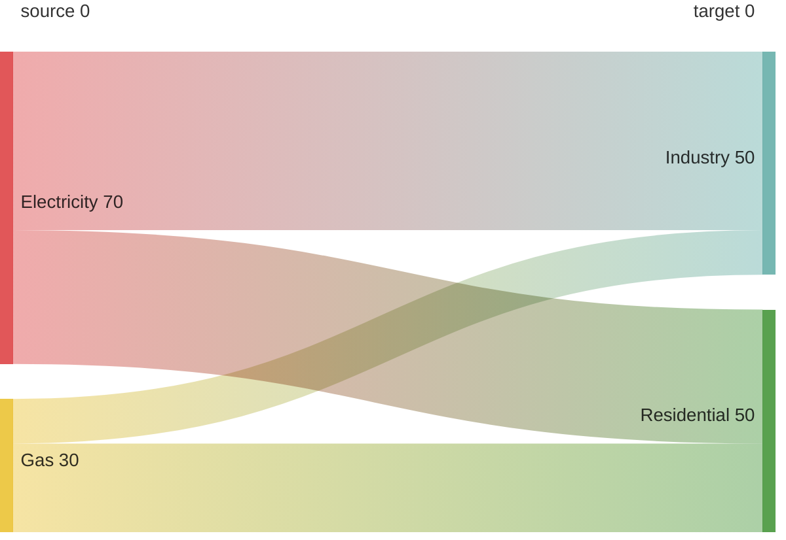

# Sankey Diagram Syntax

## Declaration
```
sankey
```

## Data Format (CSV)
```
source,target,value
A,B,10
B,C,5
```
- Exactly 3 columns: `source`, `target`, `value`
- Empty lines allowed for visual grouping

### Special Characters
- Commas in names: wrap in double quotes - `"Name, Inc.",Target,5`
- Double quotes in names: use pair `""` - `"Name ""quoted""",Target,5`

## Configuration
```
config:
    width: number
    height: number
    linkColor: source|target|gradient|#hexColor
    nodeAlignment: justify|center|left|right
    labelStyle: legacy|outlined
    nodeWidth: number
    nodePadding: number
    showValues: boolean
    nodeColors: map
```
- `labelStyle`: `legacy` (default) or `outlined` (v11.15.0+)
- `nodeWidth`, `nodePadding`: available since v11.15.0+
- `nodeColors`: custom color map for nodes (v11.15.0+)

## Example


## Comments
```
%% This is a comment
```
