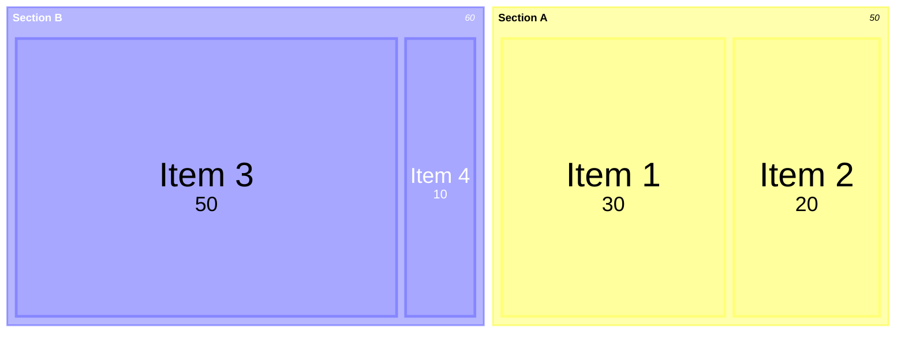

# Treemap Syntax

## Declaration
```
treemap-beta
```

## Nodes
- Parent node (section): `"Section Name"`
- Leaf node with value: `"Leaf Name": value`
- Hierarchy is defined via indentation.

## Styling
```
"Node":::className
classDef className fill:red
```

## Configuration
```
config:
    useMaxWidth: boolean
    padding: number
    diagramPadding: number
    showValues: boolean
    nodeWidth: number
    nodeHeight: number
    borderWidth: number
    valueFontSize: number
    labelFontSize: number
    valueFormat: string
```

## valueFormat (D3 format specifiers)
- `,` - thousands separator (e.g., `d` or `,d`)
- `$` - dollar prefix
- `.1f` - one decimal place
- `.1%` - percentage with one decimal
- `.2s` - SI prefix with two significant digits

## Theme Support
Treemap supports Mermaid theme variables for consistent styling.

## Example


## Comments
```
%% This is a comment
```
