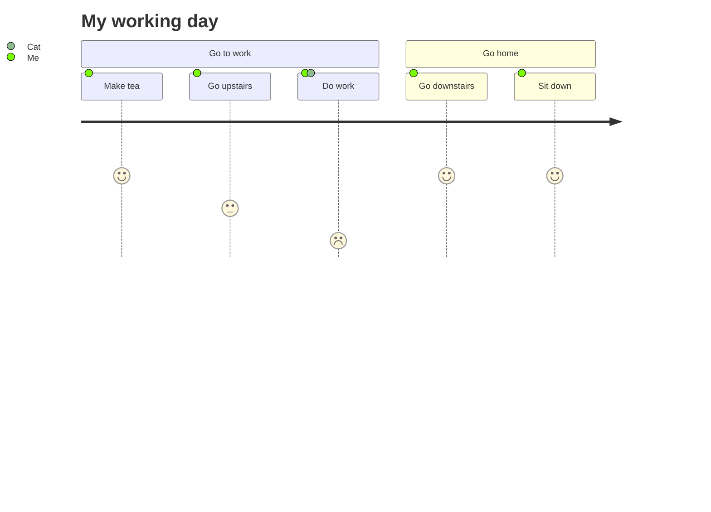

# User Journey Diagram Syntax

## Declaration
```
journey
```

## Title
```
title Chart Title
```

## Sections
```
section Section Name
```

## Tasks
```
Task name: score: comma-separated-actors
```
- **score**: 1-5 (1 = low satisfaction, 5 = high satisfaction)
- **actors**: comma-separated list of participant names

## Example


## Comments
```
%% This is a comment
```
